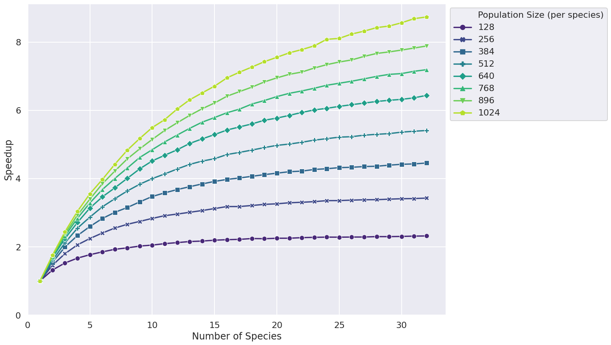
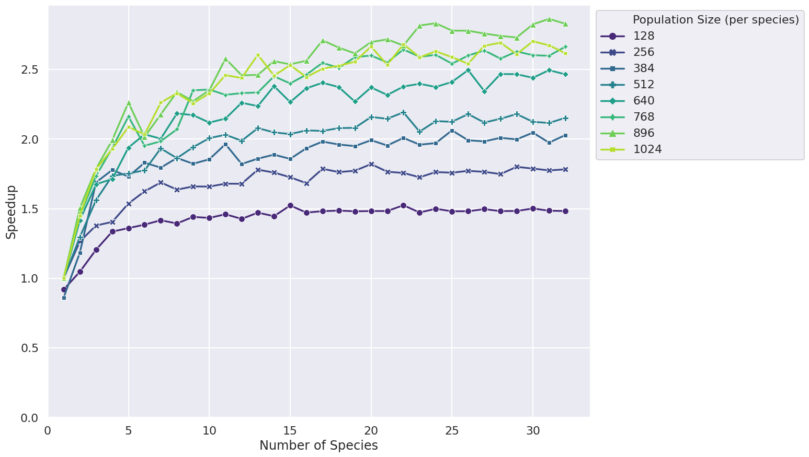
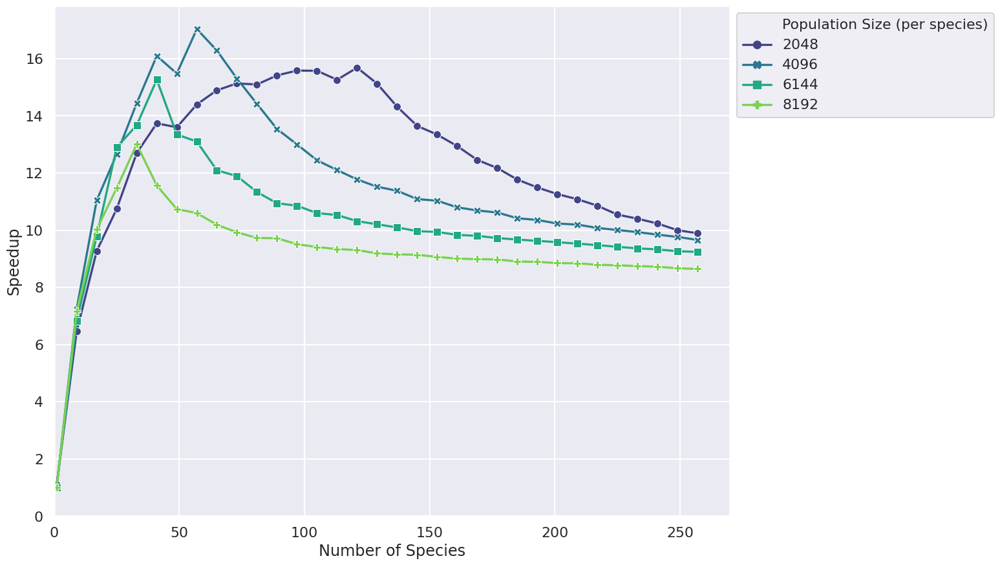

# FLAMEGPU2 Concurrency Experiments

This repository contains the figures relating to concurrency shown in the talk *Simulate the World and Everything in It: Complex Systems Simulations with FGPU2* given by Paul Richmond at [GTC 2021](https://www.nvidia.com/en-us/gtc/topics/developer-tools/), along with the code to generate them. The code demonstrates the effect and scaling of the concurrency feature of the FLAMEGPU2 agent-based modelling framework. Please note that generated figures may differ slightly as a result of the stochastic nature of the simulations and hardware differences.

## Figures

### Small Populations Speedup (Brute force)


*__Small populations brute force__ This figure shows the speedup gained by enabling concurrent execution of the agent functions of different species in a brute force messaging boids model.*

Generated using an `NVIDIA Titan V` GPU.

### Small Populations Speedup (Spatial)


*__Small populations spatial__ This figure shows the speedup gained by enabling concurrent execution of the agent functions of different species in a spatial messaging boids model. The maximum speedup is not as high as the brute force model, as the kernels have less work to do as a result of the spatial message partitioning.*

Generated using an `NVIDIA Titan V` GPU.

### Large Populations Speedup - Speedup Falloff (Brute force)


*__Large populations brute force__ This figure shows how the speedup scales with number of species and population size for larger populations.*

Generated using an `NVIDIA Titan V` GPU.

### Device Maxed


*__Device maxed__ This figure shows that for sufficiently large species which fully occupy the device, there is no significant difference in performance.*

Generated using an `NVIDIA Titan V` GPU.

## Building the Experiments

[FLAMEGPU2](https://github.com/FLAMEGPU/FLAMEGPU2) is downloaded via CMake and configured as a dependency of the project.

### Dependencies

The dependencies below are required for building FLAME GPU 2.

+ [CMake](https://cmake.org/download/) `>= 3.18`
  + CMake `>= 3.15` currently works, but support will be dropped in a future release.
+ [CUDA](https://developer.nvidia.com/cuda-downloads) `>= 11.0` and a Compute Capability `>= 3.5` NVIDIA GPU.
  + CUDA `>= 10.0` currently works, but support will be dropped in a future release.
+ C++17 capable C++ compiler (host), compatible with the installed CUDA version
  + [Microsoft Visual Studio 2019](https://visualstudio.microsoft.com/) (Windows)
  + [make](https://www.gnu.org/software/make/) and either [GCC](https://gcc.gnu.org/) `>= 7` or [Clang](https://clang.llvm.org/) `>= 5` (Linux)
  + Older C++ compilers which support C++14 may currently work, but support will be dropped in a future release.
+ [git](https://git-scm.com/)

### Building FLAME GPU 2

FLAME GPU 2 uses [CMake](https://cmake.org/), as a cross-platform process, for configuring and generating build directives, e.g. `Makefile` or `.vcxproj`. This is used to build the FLAMEGPU2 library, examples, tests and documentation.

Below the core commands are provided, for the full guide refer to the main [FLAMEGPU2 guide](https://github.com/FLAMEGPU/FLAMEGPU2/blob/master/README.md).

#### Linux

Under Linux, `cmake` can be used to generate makefiles specific to your system:

```bash
mkdir -p build && cd build
cmake .. 
make -j8
```

The option `-j8` enables parallel compilation using up to 8 threads, this is recommended to improve build times.

By default a `Makefile` for the `Release` build configuration will be generated. This is the configuration which was used to generate the results for the paper/talk.

#### Windows

*Note: If installing CMake on Windows ensure CMake is added to the system path, allowing `cmake` to be used via `cmd`, this option is disabled within the installer by default.*

When generating Visual studio project files, using `cmake` (or `cmake-gui`), the platform **must** be specified as `x64`.

Using `cmake` this takes the form `-A x64`:

```bash
mkdir build && cd build
cmake .. -A x64
ALL_BUILD.sln
```

## Running the Experiments

By default all experiments are run and data will be generated to create all of the figures.

To run the experiments, run the generated binary file which will be found in `bin/Release/`

## Generating Graphs

### Required

* [Python](https://www.python.org/downloads/) >= 3.0: Required for generating graphs

### Graph Generation
Run the command:

```bash
python3 graphs.py
```

from the `build` folder. This will generate the figures in the `figures` folder
